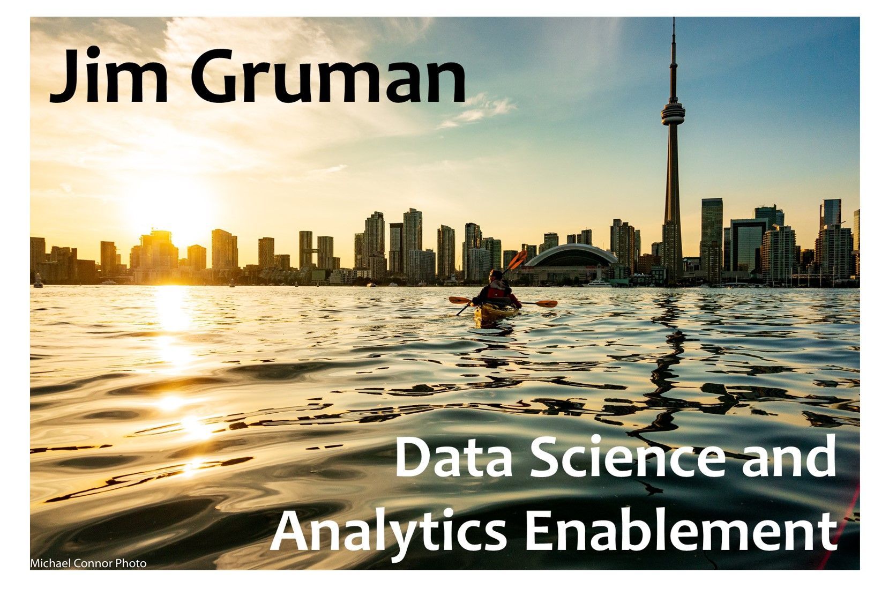

## Hi there 👋 I’m Jim and I work as a Platform / ML / Data / DevOps / Mechanical Engineer

### 🔭 I’m currently working on

-   Building a global analytics community of practice
-   Building out tools, infrastructure, and applications for the Machine
    Learning platform teams at CNH Industrial

### 🤔 I’m currently thinking about 💡

-   How companies develop & run world-class ML systems (Full Stack Deep
    Learning)
-   How to develop robust production level pipelines using Azure,
    Docker, Kubernetes, and MLFlow
-   How to keep growing as an effective engineer in R, Python, & SQL

### 🚀 In my free time I love

-   🚲 Cycling
-   📚 History
-   🌄 Backpacking
-   ✈️ Travel
-   🌱 Mentoring with the [R for Data
    Science](https://www.rfordatasci.com/) Online Learning Community
-   🔥 Scouting

<!-- README.md is generated from README.Rmd. Please edit that file -->
<!-- badges: start -->
<!-- badges: end -->

Find me around the web 🌎 at:

-   Learning in public on [Twitter](https://twitter.com/jim_gruman) or
    my [Netlify blog](https://jimgruman.netlify.app/) 📹 ✍🏾
-   Sharing updates on
    [LinkedIn](https://www.linkedin.com/in/jim-gruman-%F0%9F%93%88msba-a67779a/)
    💼
<a rel="me" href="https://fosstodon.org/@jimgruman">Mastodon</a>
